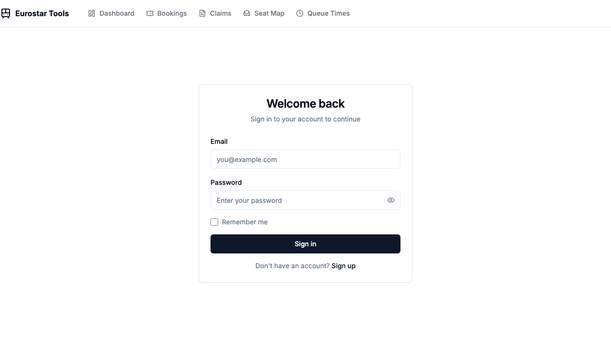

# Eurostar Tools

[](https://github.com/your-org/eurostar-tools/actions)
[](https://opensource.org/licenses/MIT)
[](https://nodejs.org/)
[](https://www.typescriptlang.org/)

A suite of tools for Eurostar travelers: delay compensation automation (AutoClaim), seat intelligence (RailSeatMap), and queue prediction (EuroQueue).

## Screenshots

| Dashboard | Login |
|-----------|-------|
|  |  |

## Features

- **AutoClaim** - Automated delay compensation claim generation
  - Email parsing to extract booking details
  - Real-time GTFS-RT delay monitoring
  - Automatic eligibility calculation based on EU regulations
  - Pre-filled claim form generation (human-in-the-loop submission)

- **RailSeatMap** - Seat intelligence and recommendations
  - Visual seat maps for all Eurostar train types
  - Seat attribute data (window, table, quiet coach, etc.)
  - Smart seat recommendations based on preferences

- **EuroQueue** - Queue time prediction
  - Historical queue data analysis
  - Predictive wait times by station and time of day
  - Real-time updates during peak periods

## Quick Start

### Prerequisites

- Node.js >= 20.0.0
- pnpm >= 9.0.0
- PostgreSQL 16
- Redis 7

### Installation

```bash
# Clone the repository
git clone https://github.com/your-org/eurostar-tools.git
cd eurostar-tools

# Install dependencies
pnpm install

# Set up environment variables
cp .env.example .env

# Run database migrations
pnpm db:migrate

# Seed development data
pnpm db:seed

# Start development servers
pnpm dev
```

### Common Commands

```bash
pnpm dev              # Start all services in dev mode
pnpm build            # Build all packages
pnpm test             # Run all tests
pnpm test:watch       # Run tests in watch mode
pnpm lint             # Lint all packages
pnpm typecheck        # Type check all packages
pnpm db:studio        # Open Drizzle Studio
```

## Tech Stack

- **Monorepo**: Turborepo + pnpm workspaces
- **Backend**: Node.js 20 + TypeScript 5.3 + Fastify
- **Database**: PostgreSQL 16 + Drizzle ORM
- **Frontend**: Next.js 14 (App Router) + Tailwind + shadcn/ui
- **Queue**: BullMQ + Redis 7
- **Testing**: Vitest + Playwright
- **Deployment**: Docker + Railway/Fly.io

## Documentation

- [Architecture](docs/ARCHITECTURE.md) - System design and data flow
- [API Reference](docs/API.md) - REST API documentation
- [Development Guide](docs/DEVELOPMENT.md) - Local setup and coding conventions
- [Deployment](docs/DEPLOYMENT.md) - Production deployment instructions
- [Monitoring](docs/MONITORING.md) - Observability and alerting
- [User Guide](docs/USER_GUIDE.md) - End-user documentation
- [Production Plan](docs/PRODUCTION_PLAN.md) - Roadmap and milestones
- [Feasibility Study](docs/feasibility_synthesis.md) - Full project analysis

## License

MIT
